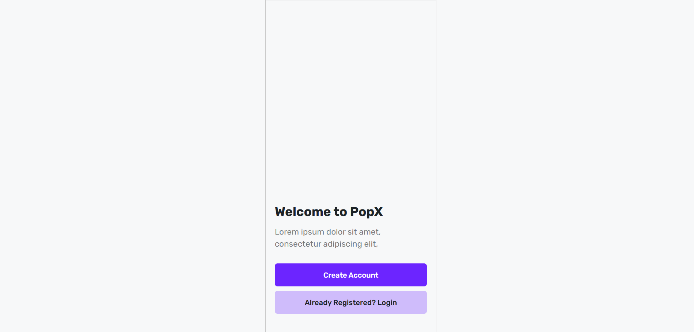

# PopX - Account Management System

A modern React-based account management system with authentication flow, form validation, and responsive design.

## Features

- **User Authentication**
  - Login with email/password
  - Account registration
  - Form validation with regex patterns
  - Toast notifications for user feedback

- **Responsive Design**
  - Fully responsive layout
  - Mobile-first approach
  - Cross-device compatibility

- **UI/UX Highlights**
  - Clean, modern interface
  - Interactive form elements
  - Loading states
  - Error handling with user-friendly messages
  - Consistent color scheme and styling

## Technologies Used

- **Frontend**
  - React.js
  - React Router v6
  - Tailwind CSS
  - react-toastify

- **Development Tools**
  - Vite (for fast development)
  - ESLint (code linting)
  - Prettier (code formatting)
